# Aesthetic CLI

Modular terminal animation playground built with [Ink](https://github.com/vadimdemedes/ink) and TypeScript. Browse and launch animations from an interactive menu.

<p align="center">
  
</p>

## Getting Started

### Prerequisites

- Node.js 18+

### Install

```bash
npm install
```

### Run

```bash
npm start
```

This opens an interactive menu where you can browse and launch animations.

### Development

```bash
npm run dev
```

Watches for file changes and restarts automatically.

## Controls

| Context    | Key          | Action                    |
| ---------- | ------------ | ------------------------- |
| Menu       | `↑` / `↓`   | Navigate animation list   |
| Menu       | `Enter`      | Launch selected animation |
| Menu       | `q`          | Quit                      |
| Animation  | `q` / `Esc`  | Return to menu            |

## Available Animations

| Animation | Description                                                                 |
| --------- | --------------------------------------------------------------------------- |
| Watch     | Live clock displaying the current time as large ASCII art digits (HH:MM:SS) with the full date below. Updates every second. |
| DNA Helix | Rotating double helix with colored base pairs (A-T, G-C). Cyan and magenta strands with red, yellow, green, and magenta rungs. |
| Matrix Rain | Digital rain with half-width katakana, character mutation, phosphor-fade gradient, glitch pulses, and variable stream speeds. |
| Nyan Cat | Rainbow-trailing cat with parallax star field, sprite animation, and sparkle particle system. |
| System Monitor | Real-time CPU, Memory & GPU dashboard with braille dot-matrix charts, per-core gauges, and nvidia-smi integration. |